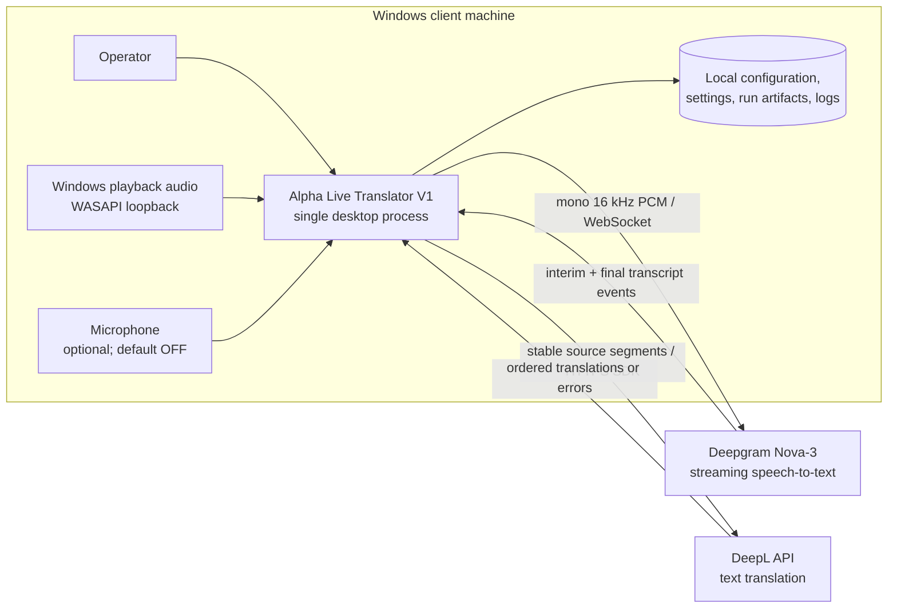
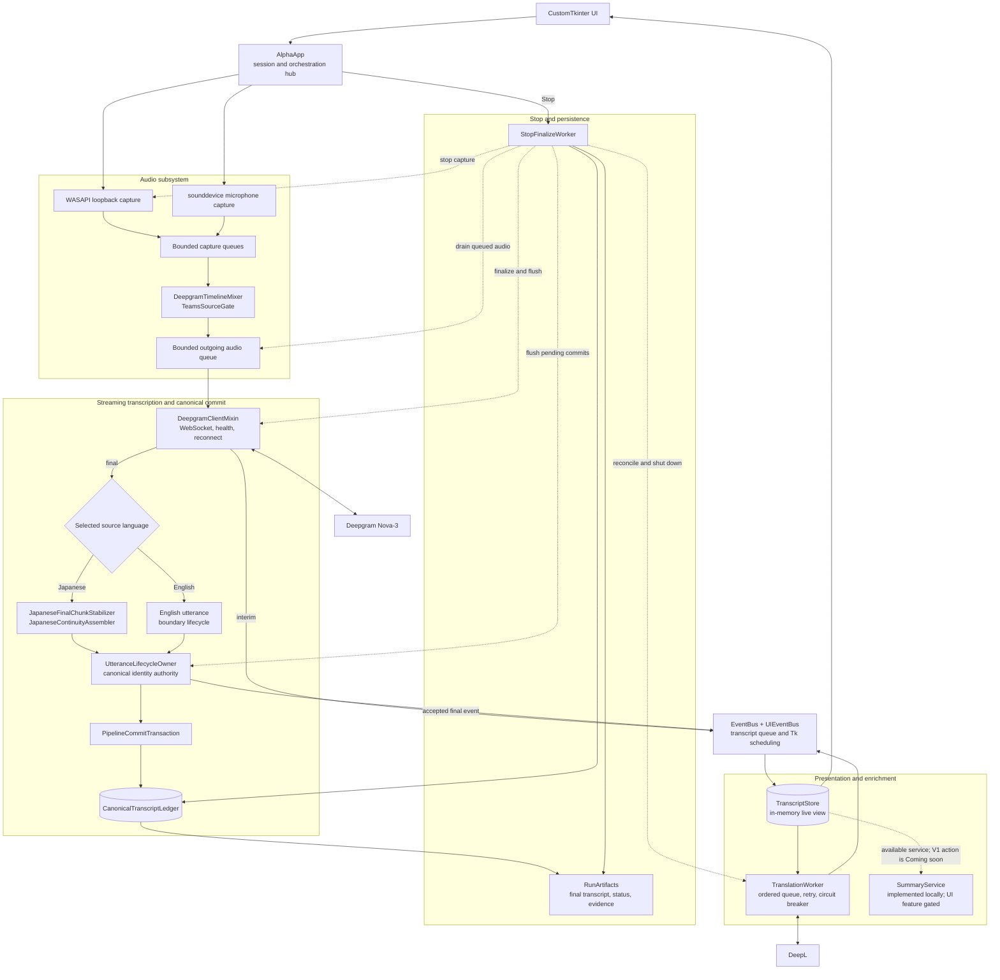
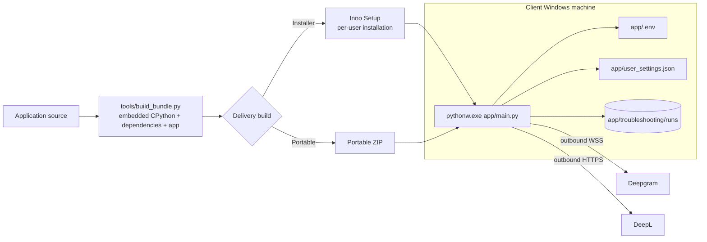

# Alpha Live Translator V1 — High-Level Architecture

| Item | Value |
|---|---|
| Architecture | As-built V1 desktop architecture |
| Internal app build | `3.3.5.5.8.5.26.5.3` |
| Verified source baseline | Git commit `57890c3b` |
| Entry point | `main.py` |
| Runtime | Windows 10/11 x64, Python desktop process |
| Last verified | 2026-08-24 |

> ⚠️ **Verified at `57890c3b` / build `…26.5.3`, which is now well behind the
> code.** Packages 26.5.4 → 26.5.15 shipped after this was written, and the
> audio-capture sections below predate all of it. Not yet reflected here: the
> per-chunk audio format stamp; the WASAPI **and microphone** rebinds that
> follow a default-device change, on their own worker thread; the shared
> default-endpoint watcher covering both render and capture; and the
> `system_source_live` / `mic_source_live` frame metadata. See `FIX_SEQUENCE.md`
> phase 5 onward. Everything else in this document was accurate at its stamp.

This document is the high-level source of truth for the current V1 product. It describes the live runtime, external boundaries, state ownership, concurrency model, finalization path, and deployment shape. Benchmark, repair, and historical scripts are engineering tools and are not part of the normal user runtime.

## 1. Architecture summary

Alpha Live Translator V1 is a **single-process, event-driven Windows desktop application**. It captures Windows playback audio through WASAPI and, when enabled, microphone audio; converts both sources to a paced mono 16 kHz PCM stream; and sends that stream to Deepgram Nova-3 over WebSocket. Interim text is shown as a live preview. Final text follows a language-specific boundary strategy, but both English and Japanese converge on one canonical identity and ledger-commit authority.

Accepted transcript segments are rendered by the CustomTkinter UI and held in an in-memory `TranscriptStore`. Stable segments are translated asynchronously through DeepL without blocking transcription. When the operator stops a session, a background finalizer drains all pipelines, freezes the canonical ledger, writes final transcript and diagnostic artifacts to the local run folder, and then restores the UI.

There is **no application server, database, inbound network listener, or microservice layer** in V1.

## 2. System context

### Trust and network boundaries

| Boundary | Responsibility |
|---|---|
| Local desktop process | UI, session orchestration, audio capture/mixing, text pipelines, state, finalization |
| Deepgram | External streaming STT provider; requires `DEEPGRAM_API_KEY` |
| DeepL | Optional external translation provider; requires `DEEPL_AUTH_KEY` |
| Local filesystem | `.env`, UI preferences, logs, run evidence, partial autosaves, canonical final exports |
| Network | Outbound connections only; no listening port or public API |

## 3. Runtime component architecture

`AlphaApp` is intentionally the V1 application/controller hub. The worker, queue, event, and ledger boundaries isolate latency-sensitive work, but V1 does not introduce a second controller or service layer merely for abstraction.

Final transcript rendering remains driven by `transcript_queue`; the typed `EventBus` is supplementary for structured status, error, and lifecycle notifications. `UIEventBus` is the worker-to-Tk scheduling boundary.

## 4. End-to-end runtime flow

### 4.1 Startup

1. `main.py` installs console capture, crash hooks, diagnostic logging, and troubleshooting paths.
2. Runtime configuration is loaded from environment variables and the project-local `.env` file.
3. `AlphaApp` creates the window and its session state.
4. After the first real UI paint, the `UIEventBus`, language pipeline worker, deferred recovery, and nonessential diagnostics start in the background.

### 4.2 Start listening

1. The UI validates the selected English/Japanese source-target pair and preflights credentials.
2. A new session/run identity is created; queues, canonical identity state, ledger state, transcript state, and worker counters are reset.
3. The Deepgram sender starts and becomes ready **before** capture begins, avoiding startup audio loss.
4. WASAPI loopback capture starts and is required for the normal meeting-audio path. Microphone capture starts only when the operator enabled it before the session; microphone failure degrades to system-audio-only operation.
5. The mixer thread drains both capture queues, normalizes them, applies source/echo gating, and emits 20 ms mono 16 kHz PCM frames to the Deepgram queue.

### 4.3 Streaming transcription and commit

1. `DeepgramClientMixin` sends PCM, handles keepalive/health/reconnect, and receives interim and final provider events.
2. Interim text is routed to the UI as a replaceable preview; it is not a canonical final record.
3. Final text is routed by the selected source language:
   - **Japanese:** final-chunk stabilization, continuity buffering, safe sentence boundaries, accuracy cleanup, and a canonical boundary proposal.
   - **English:** the utterance lifecycle buffers cumulative/incomplete finals and commits on a final boundary, utterance end, or bounded timeout.
4. Both paths converge on `UtteranceLifecycleOwner`, which owns canonical identity registration and calls `PipelineCommitTransaction`.
5. The transaction applies append/revise/suppress decisions to `CanonicalTranscriptLedger` and fails closed when identity or commit invariants are not met.
6. A successfully accepted final is published to the transcript queue. The Tk main thread drains the queue, updates `TranscriptStore`, and renders the live transcript.

### 4.4 Translation and summary capability

1. Stable transcript segments are submitted to a bounded `TranslationWorker` queue.
2. The worker translates Japanese to English or English to Japanese through `DeepLClient`, preserving accepted order with a dense translation sequence.
3. Transient provider failures use bounded retry/backoff; repeated failures open a circuit breaker. Translation degradation never blocks transcript commits.
4. Translation results are matched to transcript segments by canonical utterance identity and then marshalled to the UI thread.
5. A local, rule-based `SummaryService` is implemented, but the production V1 meeting-summary action is deliberately shown as **Coming soon**. It is not part of the normal live-session output path.

### 4.5 Stop and finalization

The Stop button returns control to Tk quickly and starts `StopFinalizeWorker` in the background. The normal high-level order is:

1. Reject new translation submissions and block new capture.
2. Stop audio producers and drain already-captured/outgoing audio.
3. Request Deepgram finalize/close and wait a bounded time for late finals.
4. Flush Japanese/English boundary state, scheduled language tasks, transcript queue, and UI batches.
5. Confirm transcript commits, flush pending translation jobs, reconcile translation gaps, and shut down the translation worker.
6. Freeze/finalize canonical state and write the authoritative final transcript from the ledger.
7. Write run status, metrics, logs, and evidence artifacts; heavier packaging/validation remains outside the latency-critical core stop path.
8. Restore the UI. A watchdog restores it even if diagnostic saving exceeds the UI budget.

## 5. State ownership and persistence

| State | Owner | Lifetime | Persistence |
|---|---|---|---|
| Window, controls, session orchestration | `AlphaApp` | Process/session | UI language preference only |
| Capture buffers and PCM queues | Audio capture + mixer + Deepgram client | Session | No; optional short-lived diagnostic audio may be retained locally |
| Canonical utterance identity | `UtteranceLifecycleOwner` + identity registry | Session/run | Reflected in run evidence and canonical record metadata |
| Authoritative transcript records | `CanonicalTranscriptLedger` | Session/run; frozen at Stop | Canonical final export and ledger evidence |
| Live display/copy/translation view | `TranscriptStore` | Process/session | Not a database; final authority remains the frozen ledger |
| Translation ordering/retry state | `TranslationWorker` | Session | Sanitized translation events and metrics in the run folder |
| Credentials and runtime options | `alpha/config.py`, environment, `.env` | Installation/process | Local `.env`; secrets are not committed or logged |
| UI language preference | `alpha/ui/strings.py` | Installation | `user_settings.json` |
| Logs and run artifacts | `run_artifacts.py` and diagnostic utilities | Run | `troubleshooting/runs/<run-id>/...` |

No SQL/NoSQL database is used. The filesystem is the persistence layer for V1 operational evidence and exports.

## 6. Concurrency and communication model

| Execution context | Main responsibility | Communication boundary |
|---|---|---|
| Tk main thread | Widgets, queue drain, UI rendering, user actions | `after(...)`, `UIEventBus`, transcript batches |
| `StartListening` worker | Credential/session bootstrap, device open, worker startup | Posts completion to UI thread |
| WASAPI reader + device watcher | System audio capture and output-device change detection | Bounded system-audio queue |
| sounddevice callback | Optional microphone capture | Bounded microphone queue |
| Audio mixer thread | Normalize, align, gate, and pace PCM | Bounded Deepgram outgoing queue |
| Deepgram WebSocket/health workers | Send audio, receive results, reconnect, provider health | Transcript/event queues and pipeline callbacks |
| `LanguagePipelineWorker` | Scheduled continuity/hold/quarantine tasks | Pipeline locks and UI event bus |
| `TranslationWorker` | Ordered DeepL requests, retries, circuit breaker | Result callbacks marshalled to UI |
| `StopFinalizeWorker` | Non-blocking drain, flush, freeze, export | Events, bounded waits, final UI callback |
| Diagnostic/autosave workers | Logs, metrics, partial recovery artifacts | Local filesystem |

Tk widgets are main-thread-only. Worker threads do not update widgets directly; they use `UIEventBus`/Tk scheduling. Shared transcript, lifecycle, and ledger state is protected with locks and bounded operations.

## 7. V1 architecture contracts

1. **One canonical commit authority:** language-specific boundary logic may propose actions, but canonical identity assignment and ledger mutation converge through `UtteranceLifecycleOwner` and `PipelineCommitTransaction`.
2. **Frozen-ledger final export:** the final transcript is produced from canonical state, not scraped from a UI text box.
3. **UI thread isolation:** all widget mutation happens on the Tk main thread.
4. **Transcription outranks translation:** missing/quota-limited/offline DeepL degrades translation only; it must not stop transcript capture or commit.
5. **Bounded real-time work:** capture and translation queues, reconnect retry, finalization waits, and UI batches are bounded to protect responsiveness and memory.
6. **Fail-loud/fail-closed identity handling:** ambiguous revisions do not silently overwrite an unrelated canonical utterance.
7. **Secrets remain outside source:** API keys come from the environment or `.env` and are excluded from logs and Git.

## 8. Deployment architecture

- The installer targets `%LOCALAPPDATA%\Programs\Alpha Live Translator` and does not require administrator privileges.
- The portable build and installer both ship an embedded Python runtime and pinned application dependencies; the client machine does not need a separate Python installation.
- The delivery bundle contains the live app, assets, diagnostics collector, and dependency metadata. Root tests, benchmark harnesses, repair scripts, and development documents are not production services and are excluded from the shipped payload.
- The app runs through `pythonw.exe`, so startup/crash output is redirected to durable local diagnostics.
- Delivery API keys are local installation secrets. Like all credentials embedded in a distributed client, they can be extracted; use separately scoped, revocable keys.

## 9. Primary source map

| Area | Primary source |
|---|---|
| Process startup | `main.py` |
| UI and session orchestration | `alpha/ui/main_window.py` (`AlphaApp`) |
| Typed application events | `alpha/core/event_bus.py`, `alpha/core/events.py`, `alpha/core/models.py` |
| UI-thread marshaling | `alpha/utils/ui_event_bus.py`, `alpha/utils/ui_thread_guard.py` |
| System/microphone capture | `alpha/audio/wasapi.py`, `alpha/audio/microphone.py` |
| Normalize, gate, mix | `alpha/audio/processing.py`, `alpha/audio/source_gate.py`, `alpha/audio/timeline_mixer.py` |
| Deepgram streaming | `alpha/transcription/deepgram_client.py` |
| Japanese boundary strategy | `alpha/transcription/japanese_final_chunk_stabilizer.py`, `alpha/transcription/japanese_sentence_assembler.py` |
| English/shared utterance lifecycle | `alpha/transcription/utterance_lifecycle.py` |
| Canonical commit and ledger | `alpha/transcription/pipeline_commit_transaction.py`, `alpha/transcription/canonical_transcript_ledger.py` |
| Live transcript view | `alpha/summary/transcript_store.py` |
| Translation | `alpha/translation/translation_worker.py`, `alpha/translation/deepl_client.py` |
| Local summary capability | `alpha/summary/summary_service.py` |
| Stop/final export | `alpha/utils/stop_finalize_worker.py`, `alpha/utils/run_artifacts.py` |
| Configuration and STT settings | `alpha/config.py`, `alpha/constants.py`, `alpha/stt_settings.py` |
| Packaging | `tools/build_bundle.py`, `installer/build_installer.py`, `installer/alpha.iss` |

## 10. Deliberate V1 boundaries

- One Alpha session recognizes **one selected source language** (`English` or `Japanese`) through one Deepgram connection.
- System and enabled microphone audio are combined before STT. The microphone is OFF by default because a bilingual speaker using the other language would otherwise enter the same selected-language recognizer.
- A truly simultaneous bilingual meeting requires separate per-source recognizers and is not part of V1.
- Deepgram is the only STT provider. Reconnect/backoff/replay protect transient failures, but there is no alternate recognition service.
- WASAPI binds to the Windows default output device at session start. A later default-device change is detected and surfaced, but capture does not automatically migrate; Stop/Start is required.
- Translation depends on network access and DeepL credentials; transcription can operate in translation-degraded mode.
- The meeting-summary implementation is local and rule-based, but its user-facing V1 action remains gated as **Coming soon**.
- `AlphaApp` remains a large orchestration hub in V1. The architecture isolates slow work with workers and queues instead of introducing a risky controller rewrite for delivery.
- The system is designed for one desktop operator and one active session, not horizontal scaling, multi-tenancy, or server-side collaboration.
